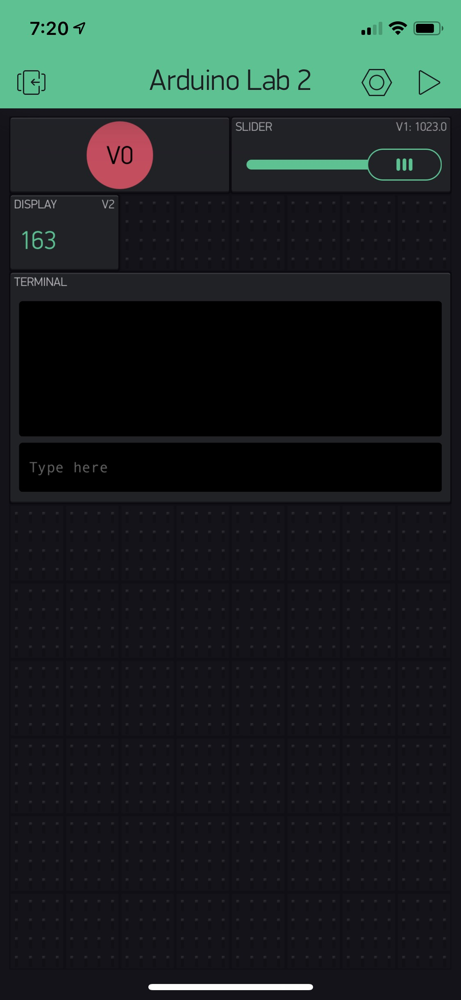

Name: Robert Cameron Scott

EID:rcs3384

Team Number: ?

## Questions

1. What is the purpose of an IP address?

    The purpose of an IP address is to give a unique name to each machine connected to the internet or a LAN.

2. What is a DNS? What are the benefits of using domain names instead of IP addresses?

    A DNS is the symbolic name associated with a particular IP address. It is useful because IP addresses are comprised of only numbers and dots and can be hard to remember.

3. What is the difference between a static IP and a dynamic IP?

    Static IP addresses never change, while dynamic IP adresses are assigned to the device by the network as they connect, and can change.

4. What is the tradeoff between UDP and TCP protocols?

    TCP is more reliable, but UDP is faster.

5. Why can't we use the delay function with Blynk?

    We can't use the delay function with Blynk because it would block all the other functions from being called.

6. What does it mean for a function to be "Blocking"?

    A function is blocking if it prevents other routines from being run at the same time, such as a delay function.

7. Why are interrupts useful for writing Non-Blocking code?

    They allow routines to be called and executed without having to poll constantly for them.

8. What is the difference between interface and implementation? Why is it important?

   The interface defines how a function is called, while the implementation describes how that function operates. It is important because it allows for abstraction of implementation through the interface.

9. Screenshot of your Blynk App:

    
